# JokeMaster Game Mechanics Documentation

## Table of Contents
1. [Overview](#overview)
2. [Core Game Loop](#core-game-loop)
3. [System Layers](#system-layers)
4. [Data Structures](#data-structures)
5. [Game Flow Diagrams](#game-flow-diagrams)
6. [Project Goals](#6-project-goals)

---

## Overview

JokeMaster is a narrative strategy game where Rain, a comedian and activist, must secure £50,000 in funding for a world-changing project by using humor to win over contacts in different cities. The game combines resource management, character interaction, and strategic joke selection.

### Win Condition
- Secure £50,000 total funding by winning favor with contacts (4 available)
- Each contact can provide £10,000-£15,000 if their favor reaches ≥70%

### Core Resources
1. **Funding (£)**: Monetary resource, goal is £50,000
2. **Energy (⚡)**: Turn-based resource, 5 max, used to play joke cards
3. **Laugh Energy (😂)**: Renewable goodwill resource, 10 max, gained from successful jokes
4. **Favor (%)**: Per-contact relationship metric, 0-100%

---

## Core Game Loop

```mermaid
graph TD
    A[Start Game] --> B[Overworld Map]
    B --> C{Player Action}
    C -->|Move to Character| D[Approach Contact]
    C -->|Navigate| E[View Globe/Map]
    C -->|Manage Resources| F[Open BANK Page]

    D --> G[Start Conversation]
    G --> H[View Contact Dialogue]
    H --> I[Select Joke Card]
    I --> J[Play Joke]
    J --> K[Calculate Favor Change]
    K --> L[Gain Laugh Energy?]
    L --> M{Check Outcome}

    M -->|Favor ≥ 70%| N[Success: Gain Funding]
    M -->|Favor ≤ 20%| O[Failure: No Funding]
    M -->|Energy = 0 or Turns = 5| P[Time Up]
    M -->|Continue| I

    N --> Q{Total Funding ≥ £50,000?}
    O --> R[Return to Overworld]
    P --> S[Partial Funding if Favor ≥ 50%]
    S --> R

    Q -->|Yes| T[WIN: Project Funded]
    Q -->|No| R
    R --> B
```



---

## System Layers

### Layer 1: Monetary Economy (Funding)

**Primary Resource**: British Pounds (£)

| Metric | Value |
|--------|-------|
| Goal | £50,000 |
| Sources | Contact funding (4 contacts) |
| Range per Contact | £10,000 - £15,000 |
| Total Available | £50,000 (exact goal) |

**Funding Acquisition**:
- **High Success** (Favor ≥ 70%): Full funding amount
- **Partial Success** (50% ≤ Favor < 70%, Time Up): 40% of funding amount
- **Failure** (Favor < 50% or ≤ 20%): £0

**Contacts & Funding**:
1. **Marcus Chen** (Tech CEO) - £15,000
2. **Dr. Sarah Williams** (Non-Profit Director) - £10,000
3. **James Rodriguez** (City Council Member) - £12,000
4. **Zara Okonkwo** (Venture Capitalist) - £13,000

### Layer 2: Turn-Based Energy System

**Resource**: Energy (⚡)

| Metric | Value |
|--------|-------|
| Starting Energy | 5 per conversation |
| Maximum Energy | 5 |
| Regeneration | Resets to 5 at start of each new conversation |
| Usage | Each joke card costs 1-3 energy |
| Turn Limit | 5 turns per conversation |

**Energy Costs by Joke Type**:
- **Low Cost (1 energy)**: Self-Deprecating, Wholesome, Observational
- **Medium Cost (2 energy)**: Tech Humor, Political, Corporate Satire
- **High Cost (3 energy)**: Ambitious, Controversial

**Conversation End Conditions**:
1. Energy reaches 0
2. Turn count reaches 5
3. Favor reaches ≥70% (success)
4. Favor reaches ≤20% (failure)

### Layer 3: Laugh Energy System (NEW)

**Resource**: Laugh Energy (😂)

| Metric | Value |
|--------|-------|
| Starting Value | 3 |
| Maximum Capacity | 10 |
| Persistence | Carries across all conversations |
| Primary Use | Recruit comedians (2 energy each) |

**Gaining Laugh Energy**:

```mermaid
graph LR
    A[Play Joke Card] --> B{Favor Impact}
    B -->|favorChange > 10| C[+2 Laugh Energy]
    B -->|0 < favorChange ≤ 10| D[+1 Laugh Energy]
    B -->|favorChange ≤ 0| E[+0 Laugh Energy]
    C --> F[Cap at 10 Max]
    D --> F
    E --> F
```


**Spending Laugh Energy**:
- **Comedian Recruitment**: 2 energy per comedian (max 3 comedians)
- **Future Features**: Joke boosts, risky options, recovery from failures

### Layer 4: Favor System (Per-Contact Relationship)

**Metric**: Favor (%)

| State | Range | Outcome |
|-------|-------|---------|
| Success | ≥70% | Full funding awarded |
| Neutral | 21-69% | No funding (unless time up) |
| Partial (Time Up) | 50-69% | 40% of funding awarded |
| Failure | ≤20% | Conversation ends, no funding |

**Favor Calculation**:
```
Initial Favor = 50% (all contacts start neutral)

For each joke played:
  favorChange = sum of tag impacts

  For each tag in joke.tags:
    if tag in character.likes:
      favorChange += joke.favorImpact[tag] (typically +10 to +15)
    if tag in character.dislikes:
      favorChange -= 15

  character.favor = clamp(character.favor + favorChange, 0, 100)
```

**Discovered Preferences**:
- Tags are revealed when they match likes/dislikes
- Displayed as 👍 (liked) or 👎 (disliked) in conversation UI
- Persist for the duration of that conversation only

### Layer 5: Comedians as Strategic Assets (NEW)

**Collectibles**: 5 Comedians (recruit max 3)

| Comedian | Location | Comedy Style | Passive Bonus | Cost |
|----------|----------|--------------|---------------|------|
| Robin Quick | London | Improvisation | +5 observational, self-deprecating | 2 😂 |
| Maria Santos | São Paulo | Storytelling | +5 wholesome, political | 2 😂 |
| Kai Chen | Singapore | Tech-Satire | +5 tech, ambitious | 2 😂 |
| Amara Okafor | Lagos | Bold-Provocateur | +5 political, controversial | 2 😂 |
| Diego Rivera | Mexico City | Confident-Showman | +5 boastful, ambitious | 2 😂 |

**Recruitment Mechanics**:
1. View comedian on globe (gold marker) or in BANK page
2. Click to view details and passive bonus
3. Spend 2 Laugh Energy to recruit (if slot available)
4. Comedian's bonus applies to ALL future joke interactions
5. Bonuses stack if multiple comedians boost the same tag

**Passive Bonus Application** (Not Yet Implemented):
```javascript
// When calculating favor change
if (gameState.recruitedComedians.has('robin')) {
  if (jokeTags.includes('observational') || jokeTags.includes('self-deprecating')) {
    favorChange += 5; // Robin's bonus
  }
}
```

### Layer 6: Comedic Artifacts (NEW)

**Collectibles**: 6 Artifacts (collect all 6)

| Artifact | Rarity | Location | Effect Type | Effect |
|----------|--------|----------|-------------|--------|
| Groucho's Disguise | Common | London | Favor Buffer | +5 favor cushion |
| Clown's Courage | Common | São Paulo | Laugh Energy Gain | +1 energy after jokes |
| Distinguished Monocle | Uncommon | Singapore | Tag Modifier | +8 corporate, ambitious |
| Court Jester's Cap | Uncommon | Lagos | Tag Modifier | +8 political, controversial |
| Veteran's Comedy Badge | Rare | Mexico City | Energy Discount | -1 energy cost all jokes |
| The Lucky Tie | Rare | New York | Reroll Chance | 20% reroll failed jokes |

**Discovery Mechanics** (Not Yet Implemented):
- Found by visiting cities (contacts or comedian locations)
- Automatically collected when city is visited
- Displayed in BANK page once found
- Effects activate when collected

**Effect Types**:
1. **Favor Buffer**: Prevents favor from dropping as much
2. **Laugh Energy Gain**: Bonus energy after each joke
3. **Tag Modifier**: Boosts specific joke tags
4. **Energy Discount**: Reduces energy cost of jokes
5. **Reroll Chance**: Allows retry on failed jokes

---

## Data Structures

### Game State
```javascript
gameState = {
  // Core Resources
  funding: 0,                    // Current funding (£)
  fundingGoal: 50000,            // Target funding (£)
  energy: 5,                     // Current conversation energy
  maxEnergy: 5,                  // Max conversation energy
  laughEnergy: 3,                // Current laugh energy
  maxLaughEnergy: 10,            // Max laugh energy capacity

  // Conversation State
  currentCharacterIndex: 0,      // Which contact (0-3)
  turnsWithCharacter: 0,         // Turns in current conversation
  maxTurns: 5,                   // Max turns per conversation
  mode: 'overworld',             // 'overworld' or 'conversation'

  // Collections
  usedCards: Set(),              // Joke IDs used in current conversation
  discoveredPreferences: Set(),  // Tags revealed in current conversation
  completedCharacters: Set(),    // Contact names fully conversed with
  recruitedComedians: Set(),     // Comedian IDs recruited (max 3)
  artifacts: Set(),              // Artifact IDs collected (max 6)

  // Map Position
  playerPosition: { x: 2, y: 3 }, // Grid coordinates
  maxComedians: 3                 // Recruitment limit
}
```

### Character Structure
```javascript
character = {
  name: "Marcus Chen",
  role: "Tech Startup CEO",
  emoji: "👔",
  position: { x: 4, y: 1 },      // Map grid position
  location: "Downtown Tech Hub",
  locationDesc: "Description...",
  dialogue: "Opening dialogue...",
  favor: 50,                      // Current favor (0-100)
  likes: ["self-deprecating", "tech", "ambitious"],
  dislikes: ["political", "crude"],
  fundingAmount: 15000            // Funding if successful
}
```

### Joke Card Structure
```javascript
jokeCard = {
  id: 1,
  type: "Self-Deprecating",
  setup: "Joke text...",
  tags: ["self-deprecating", "observational"],
  energy: 1,                      // Energy cost to play
  strategyHint: "Hint text...",
  favorImpact: {
    "self-deprecating": 15,       // Favor gained if tag liked
    "observational": 10
  }
}
```

### Comedian Structure
```javascript
comedian = {
  id: 'robin',
  name: "Robin Quick",
  emoji: "🎤",
  comedyStyle: "improvisation",
  location: "London",
  coordinates: { lat: 51.5074, lng: -0.1278 },
  position: { x: 1, y: 1 },      // Flat map grid position
  description: "Bio text...",
  passiveBonus: {
    type: "tag_boost",
    tags: ["observational", "self-deprecating"],
    boost: 5
  },
  cost: { laughEnergy: 2 },
  recruited: false
}
```

### Artifact Structure
```javascript
artifact = {
  id: 'fake_mustache',
  name: "Groucho's Disguise",
  emoji: "🥸",
  description: "Flavor text...",
  effect: {
    type: "favor_buffer",         // Effect category
    value: 5                      // Effect magnitude
  },
  rarity: "common",               // common | uncommon | rare
  findLocation: "London",
  found: false
}
```

---

## Game Flow Diagrams

### Joke Interaction Flow


### Comedian Recruitment Flow


### Laugh Energy Lifecycle

```mermaid
graph LR
    subgraph Gain
        A[Play Joke] --> B{Joke Success?}
        B -->|Great Success| C[+2 Energy]
        B -->|Success| D[+1 Energy]
        B -->|Failure| E[+0 Energy]
    end

    subgraph Storage
        C --> F[laughEnergy]
        D --> F
        E --> F
        F --> G{Check Cap}
        G -->|> 10| H[Set to 10]
        G -->|≤ 10| I[Keep Value]
        H --> J[Persist to Firebase]
        I --> J
    end

    subgraph Spend
        J --> K[View BANK Page]
        K --> L[Recruit Comedian]
        L --> M[-2 Energy]
        M --> N[Update State]
        N --> J
    end
```



### Contact Conversation Decision Tree

```mermaid
graph TD
    A[Start Conversation] --> B[Initialize: energy=5, turns=0, favor=50]
    B --> C[Display Dialogue]
    C --> D[Show Joke Cards]
    D --> E{Player Action}

    E -->|Play Joke| F[Deduct Energy]
    F --> G[Increment Turns]
    G --> H[Calculate Favor Change]
    H --> I[Update Favor]
    I --> J[Gain Laugh Energy If Successful]
    J --> K{Check End Condition}

    K -->|favor ≥ 70%| L[SUCCESS]
    K -->|favor ≤ 20%| M[FAILURE]
    K -->|energy = 0 OR turns = 5| N{favor ≥ 50?}
    K -->|Continue| D

    L --> O[Award Full Funding]
    M --> P[Award £0]
    N -->|Yes| Q[Award 40% Funding]
    N -->|No| P

    O --> R[Mark Character Complete]
    P --> R
    Q --> R
    R --> S[Return to Overworld]

    E -->|Exit| T[Reset Conversation State]
    T --> S
```



### Overworld Navigation


### Resource Flow Ecosystem

```mermaid
graph TB
    subgraph Input
        A1[Play Successful Jokes] --> R1[Laugh Energy]
        A2[Win Over Contacts] --> R2[Funding £]
        A3[Start Conversation] --> R3[Conversation Energy]
    end

    subgraph Resources
        R1 --> B1{Spend Laugh Energy}
        R2 --> B2{Check Goal}
        R3 --> B3{Play Jokes}
    end

    subgraph Output
        B1 -->|2 Energy| C1[Recruit Comedian]
        B1 -->|Future: 1+ Energy| C2[Boost Joke]

        B2 -->|≥ £50,000| C3[WIN GAME]
        B2 -->|< £50,000| C4[Continue Playing]

        B3 -->|1-3 Energy| C5[Play Joke Card]
        C5 --> C6{Joke Result}
        C6 -->|Success| A1
        C6 -->|Failure| C7[No Energy Gain]
    end

    C1 --> D1[Passive Bonuses Active]
    D1 --> C5
    C4 --> A2
```



---

## Interaction Tables

### Joke Tags vs Character Preferences

| Character | Likes | Dislikes | Funding |
|-----------|-------|----------|---------|
| Marcus Chen (Tech CEO) | self-deprecating, tech, ambitious | political, crude | £15,000 |
| Dr. Sarah Williams (Non-Profit) | wholesome, political, observational | corporate, boastful | £10,000 |
| James Rodriguez (City Council) | political, observational, self-deprecating | crude, controversial | £12,000 |
| Zara Okonkwo (Venture Capitalist) | ambitious, boastful, tech | wholesome, self-deprecating | £13,000 |

### Joke Card Energy Costs

| Joke Type | Energy Cost | Tags | Best For |
|-----------|-------------|------|----------|
| Self-Deprecating | 1 | self-deprecating, observational | Marcus, Sarah, James |
| Wholesome | 1 | wholesome, self-deprecating | Sarah |
| Observational | 1 | observational, political | Sarah, James |
| Tech Humor | 2 | tech, self-deprecating, ambitious | Marcus, Zara |
| Political | 2 | political, observational | Sarah, James |
| Corporate Satire | 2 | corporate, observational | Counter: Marcus, Zara |
| Ambitious | 3 | boastful, ambitious | Zara |
| Controversial | 3 | political, controversial | High risk, high reward |

### Comedian Synergies

| Comedian | Best Paired With | Why |
|----------|------------------|-----|
| Robin Quick | Marcus Chen, James Rodriguez | Boosts observational, self-deprecating |
| Maria Santos | Dr. Sarah Williams, James Rodriguez | Boosts wholesome, political |
| Kai Chen | Marcus Chen, Zara Okonkwo | Boosts tech, ambitious |
| Amara Okafor | James Rodriguez | Boosts political, controversial (risky) |
| Diego Rivera | Zara Okonkwo | Boosts boastful, ambitious |

---

## State Transitions

### Conversation States

```
OVERWORLD → CONVERSATION (when approaching character)
  ├─ Initialize: energy=5, turns=0, favor=50
  ├─ Load character data
  └─ Reset usedCards, discoveredPreferences

CONVERSATION → OVERWORLD (multiple paths)
  ├─ Success Path (favor ≥ 70%)
  │   └─ Award full funding → Mark complete → Exit
  ├─ Failure Path (favor ≤ 20%)
  │   └─ Award £0 → Mark complete → Exit
  ├─ Time Up Path (energy=0 OR turns=5)
  │   ├─ If favor ≥ 50%: Award 40% funding
  │   └─ Mark complete → Exit
  └─ Manual Exit (click "Just say goodbye")
      └─ Reset state → Exit
```

### Recruitment States

```
COMEDIAN: Not Recruited
  ├─ Condition: laughEnergy ≥ 2 AND recruitedCount < 3
  │   └─ Action: Recruit (-2 energy) → RECRUITED
  └─ Condition: recruitedCount ≥ 3
      └─ State: LOCKED (cannot recruit)

COMEDIAN: Recruited
  └─ Passive bonus applies to all future joke interactions
```

### Artifact States

```
ARTIFACT: Locked (not found)
  └─ Display: ❓ mystery state, location hint

ARTIFACT: Found (discovered)
  ├─ Display: Full details, emoji, effect
  └─ Effect: Activated for all interactions
```

---

## Future Feature Hooks

### Laugh Energy Spending (Not Yet Implemented)
- **Boost Joke**: Spend 1-2 energy to increase favor impact
- **Risky Joke**: Spend 3 energy to unlock high-risk, high-reward jokes
- **Recovery**: Spend 2 energy to recover from a failed joke

### Artifact Discovery (Not Yet Implemented)
- Trigger when visiting specific cities
- Add notification/popup when artifact found
- Automatically add to artifacts Set

### Passive Bonus Application (Not Yet Implemented)
- Check recruitedComedians during favor calculation
- Add bonus to favorChange if joke tags match comedian bonuses
- Display comedian portraits during conversations to show active bonuses

### Artifact Effect Implementation (Not Yet Implemented)
- Apply effects during joke interactions
- Modify energy costs, favor calculations, or provide special abilities
- Display active artifacts in conversation UI

---

## 6. Project Goals

### Overview

Rain's ultimate mission is to secure funding for one of four visionary projects that will transform their community. The player selects a project type on the GOAL page, which provides narrative context and motivation throughout the game.

### The Four Project Types

#### Community Life Projects

**1. Eco-Wellness Housing**
- **Icon**: 🏘️
- **Description**: Sustainable, affordable housing integrated with community wellness facilities, mental health support, and green spaces designed to nurture healthy, connected communities.
- **Theme**: Community health, sustainability, social infrastructure
- **Appeal**: Resonates with characters who value wholesome, political, and observational themes

**2. Gaming Gym Centers**
- **Icon**: 🎮
- **Description**: Innovative facilities combining physical fitness with immersive gaming technology. Members level up their bodies while conquering digital worlds in a community setting.
- **Theme**: Innovation, wellness, technology
- **Appeal**: Resonates with characters who value tech, ambitious, and self-deprecating themes

#### Systems of Power Projects

**3. Democracy Upgrade**
- **Icon**: 🗳️
- **Description**: A transformative civic engagement platform that increases voter participation, improves transparency, and empowers citizens to actively shape their community's future.
- **Theme**: Civic participation, transparency, empowerment
- **Appeal**: Resonates with characters who value political, observational, and wholesome themes

**4. Universal Basic Healthcare**
- **Icon**: 🏥
- **Description**: Accessible healthcare for all residents, ensuring everyone has the medical support they need regardless of income, with preventive care and mental health services.
- **Theme**: Social equity, healthcare access, community care
- **Appeal**: Resonates with characters who value political, wholesome, and ambitious themes

### Project Selection Flow

```mermaid
graph TD
    A[Game Start] --> B[Player Opens GOAL Page]
    B --> C[View Game Story Context]
    C --> D[View Project Categories]
    D --> E{Mobile View?}

    E -->|Yes| F[Accordion: Community Life]
    E -->|Yes| G[Accordion: Systems of Power]
    E -->|No| H[Two-Column Grid Layout]

    F --> I[Select Project Option]
    G --> I
    H --> I

    I --> J{Click Project Tile}
    J --> K[Tile Highlights Selected]
    K --> L[Save to gameState.projectType]
    L --> M[Save to Firebase]
    M --> N[Button Shows: YOUR PROJECT ✓]

    N --> O{Continue Playing}
    O -->|Navigate| P[Project Type Persists]
    P --> Q[Narrative Context Throughout Game]
```



### Integration with Game Systems


### Data Structure

```javascript
// Added to gameState
gameState = {
  // ... existing properties
  projectType: null,  // One of:
                      // 'eco-wellness-housing'
                      // 'gaming-gym-centers'
                      // 'democracy-upgrade'
                      // 'universal-healthcare'
}
```

### Project Goal Display Locations

| Location | Display Method | Purpose |
|----------|---------------|---------|
| GOAL Page | Full description with selection UI | Initial project selection |
| Header (All Pages) | `£X FUNDING` indicator | Constant reminder of progress toward goal |
| BANK Page | Project icon/name in summary | Context for resource management |
| Win Screen | Project success narrative | Narrative payoff |
| Conversation Dialogue | Contextual references | Makes funding feel purposeful |

### Implementation Status

**Current**:
- ✅ Project selection UI (desktop & mobile accordion)
- ✅ Data persistence (localStorage + Firebase)
- ✅ Visual feedback (selected state, button text change)
- ✅ Responsive design (accordion on mobile)

**Future Features**:
- ⏳ Project-specific character dialogue variations
- ⏳ Project-aligned joke bonuses (e.g., Eco-Wellness +5 to wholesome jokes)
- ⏳ Project milestone system (25%, 50%, 75% funding unlocks)
- ⏳ Custom win screen narrative based on selected project
- ⏳ Project-specific contacts or events
- ⏳ Visual representation on overworld map (project HQ location)

### Project Selection Flow Chart

```mermaid
stateDiagram-v2
    [*] --> NoProject: Game Start
    NoProject --> ViewingGoals: Open GOAL Page
    ViewingGoals --> CommunityLife: Click Community Life (Mobile: Accordion)
    ViewingGoals --> SystemsPower: Click Systems of Power (Mobile: Accordion)

    CommunityLife --> EcoWellness: Select Eco-Wellness Housing
    CommunityLife --> GamingGym: Select Gaming Gym Centers

    SystemsPower --> Democracy: Select Democracy Upgrade
    SystemsPower --> Healthcare: Select Universal Basic Healthcare

    EcoWellness --> ProjectSelected
    GamingGym --> ProjectSelected
    Democracy --> ProjectSelected
    Healthcare --> ProjectSelected

    ProjectSelected --> PlayingGame: Navigate to Other Pages
    PlayingGame --> ViewingGoals: Return to GOAL Page
    ProjectSelected --> ProjectSelected: Change Selection

    ProjectSelected --> WinScreen: Reach £50,000
    WinScreen --> [*]: Project Funded!
```



### Design Philosophy

The project goal system serves multiple purposes:

1. **Narrative Grounding**: Gives players a clear "why" for their funding quest
2. **Player Agency**: Allows personalization and investment in the outcome
3. **Thematic Coherence**: Projects reflect Rain's values as comedian-activist
4. **Future Extensibility**: Foundation for project-specific gameplay variations
5. **Emotional Investment**: Success feels meaningful when tied to a specific vision

The four projects span different approaches to social change:
- **Community-focused** (Eco-Wellness, Gaming Gym): Ground-up, local transformation
- **System-focused** (Democracy, Healthcare): Top-down, structural reform

This gives players choice in what kind of change they want to pursue while maintaining the core funding mechanics.

---

**Version**: 1.1
**Last Updated**: December 26, 2024
**Implementation Status**: Core systems complete, Project Goals UI implemented, integration planned
