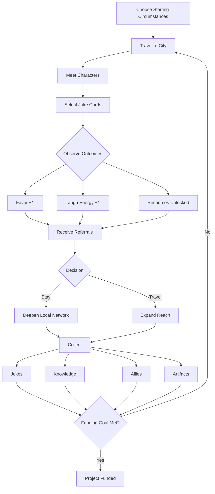
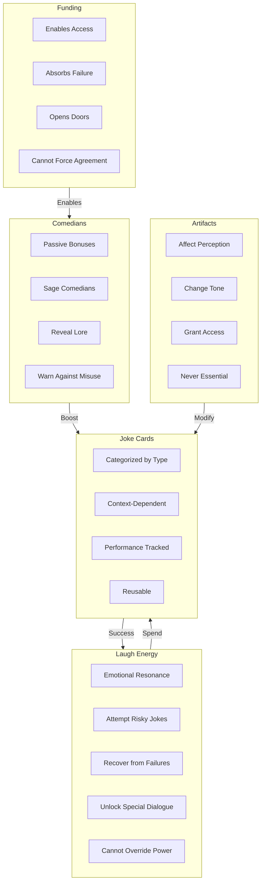
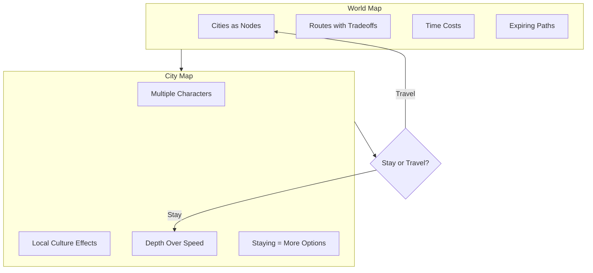
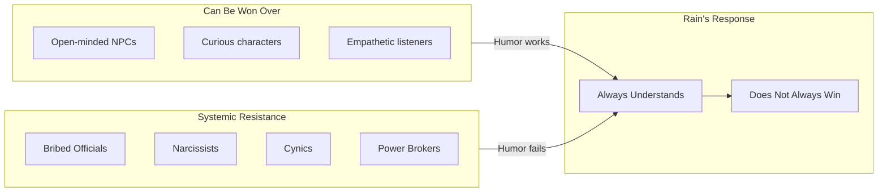
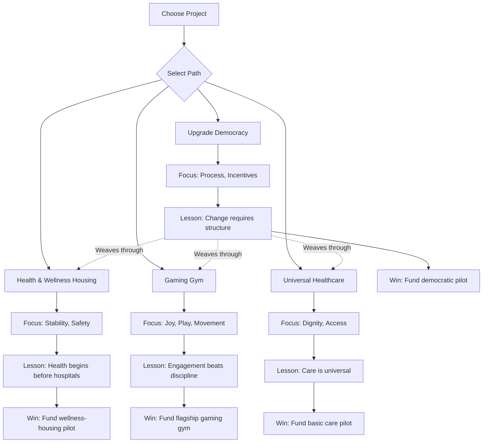
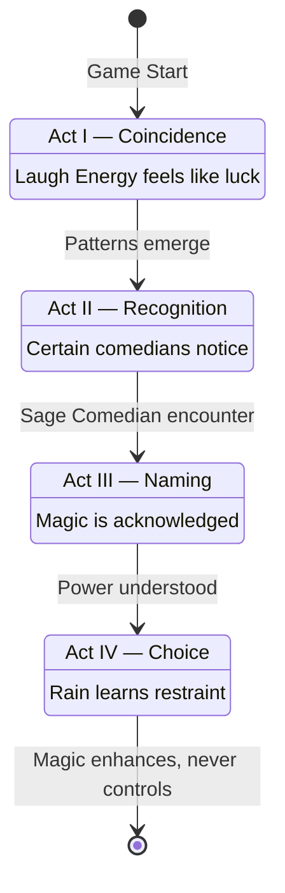
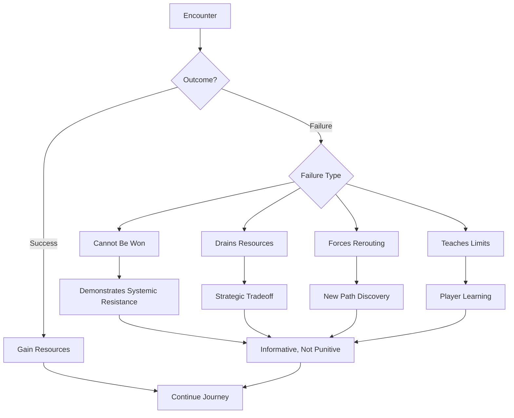

RAIN — Game Outline & Design Framework
_Last updated: 2025-12-28_

This document describes the core vision, systems, narrative structure, and educational design goals of RAIN, a narrative strategy-comedy game inspired by 80 Days.

The goal of this document is to provide a single source of truth for how story, mechanics, magic, humor, and learning interact.

---

## Table of Contents

1. [Core Vision](#1-core-vision)
2. [Design Pillars (Non-Negotiables)](#2-design-pillars-non-negotiables)
3. [Player Role: Rain](#3-player-role-rain)
4. [Core Gameplay Loop](#4-core-gameplay-loop)
5. [Resource Systems (Interconnected)](#5-resource-systems-interconnected)
6. [World & Map Structure](#6-world--map-structure)
7. [Characters & Conflict](#7-characters--conflict)
8. [Education Through Play](#8-education-through-play)
9. [Project Paths (Shared Structure, Different Meaning)](#9-project-paths-shared-structure-different-meaning)
10. [Magical Arc (Shared Across All Paths)](#10-magical-arc-shared-across-all-paths)
11. [Failure & Unwinnable Moments](#11-failure--unwinnable-moments)
12. [Endings & Replayability](#12-endings--replayability)
13. [Intended Player Experience](#13-intended-player-experience)
14. [Guiding Design Question](#14-guiding-design-question)

*Visual diagrams are included inline with each section.*

---

**1. Core Vision**
RAIN is a narrative strategy-comedy game about persuasion, power, and systems change.

The player controls Rain, a traveling idealist who uses humor to build relationships, navigate political and social systems, and fund one of four visionary projects. Beneath the surface, Rain gradually discovers that laughter itself is a subtle, real force—one that can open people emotionally but cannot override entrenched systems of power.

The game blends:

Humor and light magical realism
Steampunk-inspired worldbuilding
Real-world civic and social education
Strategic tradeoffs inspired by 80 Days
The goal is not to “fix the world,” but to help players understand how change actually happens.

**2. Design Pillars (Non-Negotiables)*
Comedy drives interaction, not combat or debate.

Understanding ≠ Winning
Rain can empathize with anyone, but cannot always succeed.

Systems Matter
Money, power, institutions, and incentives shape outcomes.

Magic Enhances, Never Replaces Reality
Laugh Energy reveals truth; it does not erase constraints.

Learning Is Collected, Not Taught
Knowledge is earned through play, not lectures.

**3. Player Role: Rain**

Rain is:

A traveler
A listener
A connector
A comedian-in-training
Quietly attuned to a form of emotional magic
Rain is not:

A savior
A lecturer
A chosen one
The player learns alongside Rain.

**4. Core Gameplay Loop**
Choose starting circumstances (including starting wealth)
Travel to a city
Meet characters
Select joke cards during conversations
Observe outcomes:
Favor gained or lost
Laugh Energy gained or spent
Resources unlocked
Receive referrals
Decide:
Stay and deepen local network
Travel and expand reach
Collect:
Jokes
Knowledge
Allies
Artifacts
Progress toward funding the chosen project

**5. Resource Systems (Interconnected)**
5.1 Funding (Money)
Enables access
Absorbs failure
Opens certain doors
Cannot force agreement
Starting wealth is chosen by the player to illustrate inequality and access.

5.2 Laugh Energy (Mystical Resource)
Represents emotional resonance and collective openness
Gained through successful humor and authentic connection
Spent to:
Attempt risky jokes
Recover from failures
Unlock special dialogue
Does not work on everyone
Cannot override entrenched power structures
Narratively framed as a subtle, ancient magic.

5.3 Jokes (Card System)
Categorized by type (satirical, empathetic, absurd, etc.)
Context-dependent effectiveness
Performance tracked over time
Reusable, but not universally effective
5.4 Comedians (Allies / Sages)
Recruitable characters with comedy styles
Provide passive or situational bonuses
Some function as Sage Comedians:
Aware of Laugh Energy
Reveal lore and ethics
Warn against misuse
Comedians are both mechanical assets and narrative guides.

5.5 Comedic Artifacts / Disguises
Lighthearted modifiers (mustaches, monocles, hats, etc.)
Affect perception, tone, and access
Reinforce humor and steampunk aesthetic
Never essential, always playful

**6. World & Map Structure**
6.1 World Map
Strategic layer
Cities as nodes
Routes with time, cost, and opportunity tradeoffs
Some paths lock or expire
6.2 City Maps
Dense interaction hubs
Multiple characters per city
Local culture affects joke effectiveness
Staying longer increases depth, not speed

**7. Characters & Conflict**
7.1 Character Philosophy
Characters are complex, flawed humans, not caricatures.

Includes:

Bribed officials
Narcissists
Cynics
Power brokers
Charmers
Recurring antagonists
Some characters:

Cannot be persuaded
Only respond to money or power
Exist to demonstrate systemic resistance
Rain always understands them.
Rain does not always win.

**8. Education Through Play**
8.1 Project Knowledge (Collected Content)
Players collect real-world information, clearly separated from magical systems:

Historical origins of ideas
Global implementations
Tradeoffs and failures
Political resistance
Cultural context
Knowledge is stored as:

Notes
Artifacts
NPC testimonies
City case studies
The UI signals what is factual vs fictional.

**9. Project Paths (Shared Structure, Different Meaning)**
All paths share interaction structure but differ in:

Tone
Knowledge collected
Types of resistance encountered
Funding goals
9.1 Health & Wellness Housing
Focus: stability, safety, prevention
Lesson: health begins before hospitals
Win Condition: fund a wellness-housing pilot
9.2 Gaming Gym
Focus: joy, play, movement
Lesson: engagement beats discipline
Win Condition: fund a flagship gaming gym
9.3 Upgrade Democracy
Focus: process, incentives, systems
Lesson: change requires structure, not slogans
Win Condition: fund a democratic pilot (e.g. ranked-choice voting)
Democracy quietly weaves through all other paths.

9.4 Basic Universal Healthcare
Focus: dignity, access, comparison
Lesson: care is universal, implementation is cultural
Win Condition: fund a basic care access pilot

**10. Magical Arc (Shared Across All Paths)**
Act I — Coincidence
Laugh Energy feels like luck.

Act II — Recognition
Certain comedians notice.

Act III — Naming
The magic is acknowledged, not glorified.

Act IV — Choice
Rain learns restraint.

Magic enhances understanding, never control.

**11. Failure & Unwinnable Moments**
Some encounters:

Cannot be won
Drain resources
Force rerouting
Teach limits
Failure is informative, not punitive.

**12. Endings & Replayability**
Each run funds one project
World is improved, not fixed
Knowledge persists across runs
New context changes interpretation of earlier encounters
Replay reveals systems literacy, not just new content.

**13. Intended Player Experience**
The player should feel:

Clever, not preached to
Curious, not judged
Empowered, not omnipotent
Educated without realizing when learning occurred
14. Guiding Design Question
For any feature or scene:

Does this help the player understand how people, humor, money, and systems interact — without telling them what to think?

If yes, it belongs.
