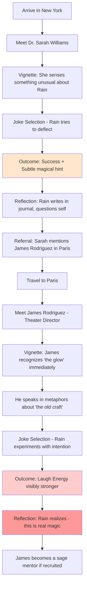

# JokeMaster Story Design

## High-Level Story Structure (Shared Across All Paths)

Think of the game as having **four narrative layers** running at once:

### The Journey Layer (shared)
- Rain traveling city to city
- Meeting people
- Telling jokes
- Collecting resources
- Managing time, energy, and referrals

### The Project Layer (primary, chosen)
- One project is foregrounded
- Funding milestones
- Project-specific artifacts, allies, jokes

### The World Layer (background, shared learning)
- Other projects appear contextually
- NPCs reference them naturally
- No "lectures," just lived examples

### The Hidden Magic Layer (emergent discovery)
- **Rain is unknowingly a Laugh Wizard**
- Laugh Energy is actual magic, not metaphor
- Rain slowly realizes they can channel joy into tangible power
- Some comedians are sage masters who recognize Rain's gift
- The world doesn't see it—only those with the gift can sense it
- **This layer emerges gradually through the journey**

**This is how you teach without preaching—and how you add wonder without explaining it away.**

---

## The Magical Realism Framework

### What Is Laugh Energy? (The Secret Truth)

In the world of JokeMaster, **laughter is literal magic**—but almost no one knows it.

- **To most people:** Laughter is just... laughter. A nice feeling. Social bonding.
- **To Rain (at first):** A metaphor for goodwill. A tool for persuasion.
- **To the awakened:** A renewable source of power that shapes reality itself.

Rain doesn't start knowing this. They think they're just charming people.

### Rain's Awakening Arc

Rain's journey from "I'm good with people" to "I'm channeling an ancient force":

1. **Early Game (Cities 1-2):** Rain notices jokes landing *differently* than expected
   - "That felt... warm. Like something shifted."
   - Small narrative beats: "You felt a strange heat behind your eyes as they laughed."

2. **Mid Game (Cities 3-5):** Patterns emerge
   - Certain people react to Rain's energy, not just their jokes
   - One NPC says: "You have *the glow*. I haven't seen it in years."
   - Rain dismisses it, but the player notices recurring imagery (light, warmth, resonance)

3. **Late Game (Cities 6-8):** Sage comedians appear
   - NPCs who explicitly recognize Rain's gift
   - They offer cryptic advice: "Don't force the laughter. Let it flow *through* you."
   - Rain starts experimenting: "What if I... tried to *feel* the energy before I spoke?"

4. **End Game:** Rain understands
   - A reflective moment: "This whole time, I thought I was begging for money. But I've been *weaving* something. Every laugh, every connection—it's real. It's *power*."
   - The project they fund isn't just practical. It's *blessed* by accumulated joy.

### Sage Comedians (The Enlightened Ones)

Some comedians Rain recruits are more than entertainers—they're **keepers of the old craft**.

**Examples:**
- **Maria Santos (São Paulo):** A storytelling master who speaks in parables
  - First meeting: "You think jokes are tools. But tools break. Jokes are *seeds*."
  - If recruited: Teaches Rain that every joke plants something in the world

- **Kai Chen (Singapore):** A tech satirist who sees the system differently
  - First meeting: "Code, comedy—it's all patterns. You're debugging reality."
  - If recruited: Helps Rain understand Laugh Energy as a *frequency* they can tune

- **Amara Okafor (Lagos):** A bold provocateur who challenges Rain directly
  - First meeting: "I can see it on you. The shimmer. You don't even know, do you?"
  - If recruited: Becomes Rain's most direct mentor in wielding the energy

**Not all comedians know.** Some are just funny. But the sages recognize Rain immediately.

### Artifacts (Relics of the Craft)

Artifacts aren't just props—they're **tools left behind by past Laugh Wizards**.

- **Groucho's Disguise (London):** Not just a mustache. It *masks intent*, making risky jokes safer.
- **Clown's Courage (São Paulo):** A red nose that *amplifies joy*, literally increasing Laugh Energy gain.
- **Court Jester's Cap (Lagos):** Worn by truth-tellers to kings. Grants *protection* when speaking to power.

Rain finds these and thinks they're symbolic. By late game, they realize: *these were wielded by others like me*.

---

## Common Screen / Interaction Pattern (80 Days–Inspired)

No matter the project, Rain repeatedly encounters screens like:

1. **Arrival in city** (narrative text, ambient description)
2. **Local contact introduction** (character portrait, name, role)
3. **Short vignette / character moment** (80 Days-style prose)
4. **Magical undertone** (subtle hints: "You felt the air thicken as they laughed")
5. **Joke selection** (strategic choice with Laugh Energy visualization)
6. **Outcome + resource change** (mechanical + narrative feedback)
7. **Referral choices** (branching paths)
8. **Reflection beat** (Rain's internal monologue or journal entry—where awakening happens)

**The structure stays the same. The content shifts. The magic deepens.**

---

## Sample Narrative: New York Arrival (80 Days Style)

### Location: Columbia University, New York

Rain stepped into the towering lobby of the psychology building, all glass and steel catching the late afternoon light. The city hummed outside—taxis, construction, a million conversations blending into white noise.

**Dr. Sarah Williams** was waiting by the elevators, tablet in hand, one eyebrow already raised in that way professors have when they're three steps ahead of you.

"Rain," she said, not unkindly. "Let's walk."

---

She led you through corridors lined with framed journal covers and grant plaques. Somewhere, a lecture was ending; students spilled out, laughing at something the professor had said.

"I study humor," Dr. Williams said, gesturing vaguely at a poster about neural pathways. "The neuroscience of it. Why we laugh. What it does to the brain. Bonding, stress relief, social cohesion."

She glanced at you.

"But you already know that, don't you?"

You weren't sure how to answer. You opened your mouth to make a joke—something self-deprecating, disarming—but she raised a hand.

"Before you start," she said, "I need you to understand something."

She stopped walking. The hallway was empty now. Quiet.

"I've spent fifteen years measuring laughter. Cortisol drops. Endorphin spikes. Oxytocin release. Very tidy. Very predictable."

Her eyes narrowed.

"Except when it isn't."

---

A beat of silence. You felt warmth at the back of your neck. The same warmth you'd felt in Mumbai, in Paris. The warmth you'd been ignoring.

"There are people," Dr. Williams continued, "who make others laugh in ways that don't fit the data. The response is... *disproportionate*. Like they're activating something we don't have instruments for yet."

She tilted her head.

"You're one of them, aren't you?"

---

**[Choice: Joke Selection]**

You could deflect. You could lean in. You could tell the truth you barely understood yourself.

But whatever you said next, you knew: *she'd felt it too*.

---

**[Reflection Beat - After the Interaction]**

That night, in a coffee shop near Washington Square, you wrote in your journal:

*Dr. Williams looked at me like I was a lab specimen. But not in a bad way. In a 'you're evidence of something I can't explain yet' way.*

*She said disproportionate. I felt... seen.*

*What if it's not just charisma? What if it's not just timing?*

*What if I'm actually DOING something when I make people laugh?*

You closed the journal. Outside, the city glowed. You felt the Laugh Energy pooling in your chest, warm and alive.

Three points. You'd earned three points just from that conversation.

You had no idea what you were building. But it felt *real*.

---

## Narrative Flow Map: New York to Paris

Here's how a sample story arc might flow across two cities, showing the magical awakening:

### Key Narrative Beats

**New York (Awakening Begins):**
- Dr. Williams: "The science doesn't explain you"
- Rain: "What do you mean?"
- *Subtle warmth, confusion, curiosity*

**Paris (Recognition):**
- James: "Ah. Another one. I thought our kind was dying out."
- Rain: "Our kind?"
- James: "Those who make joy *tangible*."
- *Rain stops dismissing it*

**Lagos (Mentorship - if you go there):**
- Amara: "Stop pretending you don't know. I can see the light pouring out of you."
- Rain: "How do I control it?"
- Amara: "You don't control laughter. You conduct it."
- *Rain begins active experimentation*

---

## The Four Project Story Outlines (Updated with Magic)

Each outline below now includes:
- Narrative tone
- What Rain is really learning
- How other projects are gently woven in
- **How the magical layer interacts with the project theme**
- A clear win condition

---

### 1. Health & Wellness Housing (Community Life)

**Tone:** Warm, human, grounded
**Core Question:** What does a healthy life actually require beyond medicine?
**Magical Theme:** *Healing through connection*

#### Story Arc
- Rain meets organizers, tenants, social workers, designers
- Encounters stories about stress, isolation, affordability
- Learns how housing stability affects health outcomes
- **Magic connection:** Laugh Energy used here feels *restorative*—like planting seeds

#### What Rain Collects
- Community advocates
- Housing policy anecdotes
- Wellness-centered jokes (empathy, relatability)
- Laugh Energy tends to grow slowly but steadily
- **Sage comedians in this path talk about "rooting" and "nourishing soil"**

#### Magical Moments
- An elder tenant says: "When you laugh with us, the walls feel warmer. Literally."
- Rain notices: jokes about *home* generate more energy than expected
- Late-game realization: "I'm not just funding housing. I'm blessing it."

#### Win Condition
- Secure enough funding to launch a pilot wellness-housing community
- Final scene shows the first residents moving in
- **Rain quietly leaves a piece of Laugh Energy embedded in the foundation**
- End text hints: *"This is one building. It won't be the last. And it will feel different than the others."*

---

### 2. Gaming Gym (Future Fitness)

**Tone:** Playful, speculative, energetic
**Core Question:** Can joy and play make people healthier?
**Magical Theme:** *Joy as transformation*

#### Story Arc
- Rain meets technologists, gamers, athletes, skeptics
- Fitness reframed as fun instead of discipline
- Some NPCs laugh, others roll their eyes
- **Magic connection:** This path has the HIGHEST Laugh Energy swings—wild, chaotic, euphoric

#### What Rain Collects
- Comedians who specialize in absurdity
- Experimental joke types
- Visual artifacts (controllers, wearables)
- Big Laugh Energy swings (high risk, high reward)
- **Sage comedians here are playful tricksters—they teach through pranks**

#### Magical Moments
- During a demo, Rain makes a joke and the VR system *glitches in beautiful ways*
- A tech NPC says: "Your energy signature is off the charts. Are you overclocking reality?"
- Rain realizes: "Play and magic are the same thing."

#### Win Condition
- Fund and launch a flagship Gaming Gym
- End scene: people of all ages playing, sweating, laughing
- **The gym's lighting seems to respond to laughter—no one can explain it**
- Question left open: *"Is this the future—or just the beginning?"*

---

### 3. Upgrade Democracy

**Tone:** Wry, observant, quietly sharp
**Core Question:** Why is something so important so hard to fix?
**Magical Theme:** *Truth-telling to power*

#### Story Arc
- Rain meets activists, cynics, election workers, donors
- Sees how systems fail in small, frustrating ways
- Learns that procedural changes matter more than slogans
- **Magic connection:** This path requires the RISKIEST jokes—speaking truth to power drains and restores energy dramatically

#### What Rain Collects
- Civic-minded comedians
- Satirical and explanatory jokes
- Policy "cards" disguised as story artifacts
- Laugh Energy often used to defuse tension
- **Sage comedians here are jesters—they know the danger and power of mockery**

#### Magical Moments
- Rain tells a joke to a powerful politician—and feels the room's energy *shift*
- A campaign manager says: "When you spoke, I swear I saw everyone lean forward at once."
- Rain realizes: "Laughter breaks hierarchies. That's not a metaphor."

#### Win Condition
- Secure funding to run a large-scale pilot (e.g., ranked-choice voting trial, civic platform)
- Final scene: election workers prepping, not celebrating
- **Rain's presence makes the volunteers feel hopeful—unnaturally so**
- Last line is understated, not triumphant

---

### 4. Basic Universal Healthcare

**Tone:** Compassionate, comparative, revealing
**Core Question:** Why is care treated differently in different places?
**Magical Theme:** *Healing systems, not just people*

#### Story Arc
- Rain travels internationally
- Encounters vastly different healthcare systems
- Humor arises from contrast, not mockery
- **Magic connection:** Laugh Energy here is CUMULATIVE and patient—it builds across borders

#### What Rain Collects
- International contacts
- Comparative data disguised as anecdotes
- Empathy-driven jokes
- High long-term Laugh Energy accumulation
- **Sage comedians here are healers—they teach Rain that laughter mends more than hearts**

#### Magical Moments
- A doctor in a free clinic says: "After you visited, our patients healed faster. Statistically faster."
- Rain realizes their energy lingers in places—like a residue of hope
- Late-game: "I'm not raising money. I'm weaving a safety net out of light."

#### Win Condition
- Secure funding to launch a basic care access pilot
- End scene shows clinics opening quietly
- **Rain leaves a subtle glow in each clinic—felt but not seen**
- Emphasis on dignity, not victory

---

## How to Prevent "Too Much Messaging"

### The Key Rule:
**Never explain a system unless an NPC needs it to justify their own experience.**

- No tutorials framed as lectures
- No "Did you know?" text
- Let jokes and reactions do the teaching
- **Let the magic emerge through implication, never exposition**

*This is exactly how 80 Days avoids exposition fatigue—and how magical realism stays subtle.*

---

## The Magic Rules (Design Philosophy)

### What We SHOW:
- Warmth, light, shimmer around Rain when jokes land
- NPCs reacting as if they felt *more* than a joke
- Sage comedians speaking in metaphor
- Artifacts glowing faintly when used
- Laugh Energy visualized as a tangible resource

### What We NEVER EXPLAIN:
- Where the magic comes from
- Why Rain has it
- Whether other Laugh Wizards exist (implied, never confirmed)
- The "rules" of the magic (it's intuitive, not systematic)

### The Player's Experience:
- Early: "Huh, that was a weird line of dialogue."
- Mid: "Wait, is this actually magic?"
- Late: "Oh. OH. Rain is a WIZARD."
- End: "I want to replay and see the signs I missed."

---

## One Shared Ending Principle

### No path ends with:
- "The world is fixed"
- "You won"
- "The magic is explained"

### Every path ends with:
- "This worked here"
- "Now it could spread"
- **"And Rain understands—they were never just raising money. They were casting a spell that will outlive them."**

**That keeps the tone humble, mysterious, and replayable.**

---

**Version:** 2.0
**Last Updated:** December 26, 2024
**Status:** Story framework complete with magical realism layer, ready for narrative implementation
**Note:** This is design documentation only—not yet implemented in game code
